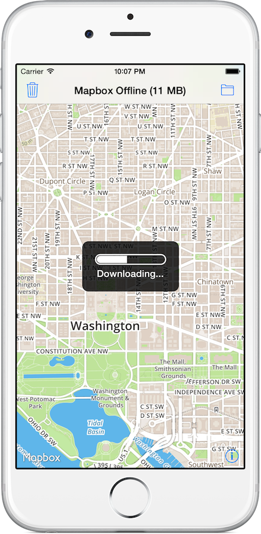

# Mapbox iOS SDK Offline Example

Canonical example of offline tile source caching with the [Mapbox iOS SDK](https://github.com/mapbox/mapbox-ios-sdk). 

App written in Swift, SDK written in Objective-C, managed via CocoaPods. 

## Setup

Makes use of [CocoaPods](http://cocoapods.org). To run: 

- `gem install cocoapods`
- `pod install`
- `open 'Mapbox Offline.xcworkspace'`
- Build & Run
